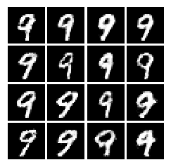

# CGAN
   ConditionalGAN顾名思义是条件GAN，就是给GAN增加一个条件。具体是怎么回事呢？看代码：
这段代码使用mnist数据集，来生成手写数字。以下代码可以直接正确运行。


```python
import tensorflow as tf
from tensorflow.examples.tutorials.mnist import input_data
import numpy as np
import matplotlib.pyplot as plt
import matplotlib.gridspec as gridspec
import os
```

    D:\Anaconda3\lib\site-packages\h5py\__init__.py:34: FutureWarning: Conversion of the second argument of issubdtype from `float` to `np.floating` is deprecated. In future, it will be treated as `np.float64 == np.dtype(float).type`.
      from ._conv import register_converters as _register_converters
    

### 读入数据
MNIST数据集


```python
mnist = input_data.read_data_sets('/MNIST_data', one_hot=True)
mb_size = 64
Z_dim = 100
X_dim = mnist.train.images.shape[1]
y_dim = mnist.train.labels.shape[1]
h_dim = 128
```

    Extracting /MNIST_data\train-images-idx3-ubyte.gz
    Extracting /MNIST_data\train-labels-idx1-ubyte.gz
    Extracting /MNIST_data\t10k-images-idx3-ubyte.gz
    Extracting /MNIST_data\t10k-labels-idx1-ubyte.gz
    

### 变量初始化和Placeholder


```python
def xavier_init(size):
    in_dim = size[0]
    xavier_stddev = 1. / tf.sqrt(in_dim / 2.)
    return tf.random_normal(shape=size, stddev=xavier_stddev)


""" Discriminator Net model """
X = tf.placeholder(tf.float32, shape=[None, 784])
y = tf.placeholder(tf.float32, shape=[None, y_dim])

D_W1 = tf.Variable(xavier_init([X_dim + y_dim, h_dim]))
D_b1 = tf.Variable(tf.zeros(shape=[h_dim]))

D_W2 = tf.Variable(xavier_init([h_dim, 1]))
D_b2 = tf.Variable(tf.zeros(shape=[1]))

theta_D = [D_W1, D_W2, D_b1, D_b2]
```

### 定义判别器
与普通的GAN没有区别，从下边开始可以看到discriminator除了输入原来的x，还输入了一个y。这个y就是我们所说的condition。接下来的generator也一样，多了一个y。


```python
def discriminator(x, y):
    inputs = tf.concat(axis=1, values=[x, y])
    D_h1 = tf.nn.relu(tf.matmul(inputs, D_W1) + D_b1)
    D_logit = tf.matmul(D_h1, D_W2) + D_b2
    D_prob = tf.nn.sigmoid(D_logit)

    return D_prob, D_logit


""" Generator Net model """
Z = tf.placeholder(tf.float32, shape=[None, Z_dim])

G_W1 = tf.Variable(xavier_init([Z_dim + y_dim, h_dim]))
G_b1 = tf.Variable(tf.zeros(shape=[h_dim]))

G_W2 = tf.Variable(xavier_init([h_dim, X_dim]))
G_b2 = tf.Variable(tf.zeros(shape=[X_dim]))

theta_G = [G_W1, G_W2, G_b1, G_b2]
```

### 定义生成器


```python
def generator(z, y):
    inputs = tf.concat(axis=1, values=[z, y])
    G_h1 = tf.nn.relu(tf.matmul(inputs, G_W1) + G_b1)
    G_log_prob = tf.matmul(G_h1, G_W2) + G_b2
    G_prob = tf.nn.sigmoid(G_log_prob)

    return G_prob


def sample_Z(m, n):
    return np.random.uniform(-1., 1., size=[m, n])


# 输出训练中间的结果
def plot(samples):
    fig = plt.figure(figsize=(4, 4))
    gs = gridspec.GridSpec(4, 4)
    gs.update(wspace=0.05, hspace=0.05)

    for i, sample in enumerate(samples):
        ax = plt.subplot(gs[i])
        plt.axis('off')
        ax.set_xticklabels([])
        ax.set_yticklabels([])
        ax.set_aspect('equal')
        plt.imshow(sample.reshape(28, 28), cmap='Greys_r')

    return fig
```


```python
G_sample = generator(Z, y)
D_real, D_logit_real = discriminator(X, y)
D_fake, D_logit_fake = discriminator(G_sample, y)
```

### Loss函数和优化器


```python
D_loss_real = tf.reduce_mean(tf.nn.sigmoid_cross_entropy_with_logits(logits=D_logit_real, labels=tf.ones_like(D_logit_real)))
D_loss_fake = tf.reduce_mean(tf.nn.sigmoid_cross_entropy_with_logits(logits=D_logit_fake, labels=tf.zeros_like(D_logit_fake)))
D_loss = D_loss_real + D_loss_fake
G_loss = tf.reduce_mean(tf.nn.sigmoid_cross_entropy_with_logits(logits=D_logit_fake, labels=tf.ones_like(D_logit_fake)))

D_solver = tf.train.AdamOptimizer().minimize(D_loss, var_list=theta_D)
G_solver = tf.train.AdamOptimizer().minimize(G_loss, var_list=theta_G)
```

### 训练
每1000次迭代输出一次标签7的结果


```python
sess = tf.Session()
sess.run(tf.global_variables_initializer())

if not os.path.exists('out/'):
    os.makedirs('out/')

i = 0

for it in range(100000):
    if it % 1000 == 0:
        n_sample = 16

        Z_sample = sample_Z(n_sample, Z_dim)
        y_sample = np.zeros(shape=[n_sample, y_dim])
        y_sample[:, 7] = 1

        samples = sess.run(G_sample, feed_dict={Z: Z_sample, y:y_sample})

        fig = plot(samples)
        plt.savefig('out/{}.png'.format(str(i).zfill(3)), bbox_inches='tight')
        i += 1
        plt.close(fig)

    X_mb, y_mb = mnist.train.next_batch(mb_size)

    Z_sample = sample_Z(mb_size, Z_dim)
    _, D_loss_curr = sess.run([D_solver, D_loss], feed_dict={X: X_mb, Z: Z_sample, y:y_mb})
    _, G_loss_curr = sess.run([G_solver, G_loss], feed_dict={Z: Z_sample, y:y_mb})


    if it % 1000 == 0:
        print('Iter: {}'.format(it))
        print('D loss: {:.4}'. format(D_loss_curr))
        print('G_loss: {:.4}'.format(G_loss_curr))
        print()

```

    Iter: 0
    D loss: 1.621
    G_loss: 2.897
    
    Iter: 1000
    D loss: 0.005972
    G_loss: 9.368
    
    Iter: 2000
    D loss: 0.03242
    G_loss: 5.243
    
    Iter: 3000
    D loss: 0.04928
    G_loss: 5.483
    
    Iter: 4000
    D loss: 0.1226
    G_loss: 4.042
    
    Iter: 5000
    D loss: 0.07861
    G_loss: 7.295
    
    Iter: 6000
    D loss: 0.2262
    G_loss: 5.127
    
    Iter: 7000
    D loss: 0.2472
    G_loss: 5.051
    
    Iter: 8000
    D loss: 0.3334
    G_loss: 4.061
    
    Iter: 9000
    D loss: 0.3491
    G_loss: 4.19
    
    Iter: 10000
    D loss: 0.4331
    G_loss: 2.997
    
    Iter: 11000
    D loss: 0.5278
    G_loss: 3.451
    
    Iter: 12000
    D loss: 0.4697
    G_loss: 2.805
    
    Iter: 13000
    D loss: 0.5265
    G_loss: 3.131
    
    Iter: 14000
    D loss: 0.6893
    G_loss: 2.87
    
    Iter: 15000
    D loss: 0.7593
    G_loss: 2.341
    
    Iter: 16000
    D loss: 0.8354
    G_loss: 2.103
    
    Iter: 17000
    D loss: 0.6545
    G_loss: 1.978
    
    Iter: 18000
    D loss: 0.8382
    G_loss: 2.398
    
    Iter: 19000
    D loss: 0.5676
    G_loss: 2.335
    
    Iter: 20000
    D loss: 0.6985
    G_loss: 2.134
    
    Iter: 21000
    D loss: 0.8371
    G_loss: 2.023
    
    Iter: 22000
    D loss: 0.8265
    G_loss: 1.92
    
    Iter: 23000
    D loss: 0.6487
    G_loss: 1.977
    
    Iter: 24000
    D loss: 0.6223
    G_loss: 2.121
    
    Iter: 25000
    D loss: 0.7542
    G_loss: 2.114
    
    Iter: 26000
    D loss: 0.6725
    G_loss: 2.111
    
    Iter: 27000
    D loss: 0.7331
    G_loss: 2.229
    
    Iter: 28000
    D loss: 0.7314
    G_loss: 1.774
    
    Iter: 29000
    D loss: 0.6833
    G_loss: 1.91
    
    Iter: 30000
    D loss: 0.5817
    G_loss: 2.247
    
    Iter: 31000
    D loss: 0.7607
    G_loss: 2.07
    
    Iter: 32000
    D loss: 0.7556
    G_loss: 1.948
    
    Iter: 33000
    D loss: 0.803
    G_loss: 2.248
    
    Iter: 34000
    D loss: 0.6514
    G_loss: 1.853
    
    Iter: 35000
    D loss: 0.6747
    G_loss: 1.953
    
    Iter: 36000
    D loss: 0.8082
    G_loss: 2.265
    
    Iter: 37000
    D loss: 0.7951
    G_loss: 2.095
    
    Iter: 38000
    D loss: 0.6332
    G_loss: 1.924
    
    Iter: 39000
    D loss: 0.5591
    G_loss: 2.171
    
    Iter: 40000
    D loss: 0.7251
    G_loss: 2.064
    
    Iter: 41000
    D loss: 0.7708
    G_loss: 2.115
    
    Iter: 42000
    D loss: 0.9198
    G_loss: 1.978
    
    Iter: 43000
    D loss: 0.6872
    G_loss: 1.925
    
    Iter: 44000
    D loss: 0.6097
    G_loss: 1.978
    
    Iter: 45000
    D loss: 0.7039
    G_loss: 1.942
    
    Iter: 46000
    D loss: 0.5629
    G_loss: 2.354
    
    Iter: 47000
    D loss: 0.8231
    G_loss: 1.996
    
    Iter: 48000
    D loss: 0.7755
    G_loss: 2.109
    
    Iter: 49000
    D loss: 0.7458
    G_loss: 2.072
    
    Iter: 50000
    D loss: 0.759
    G_loss: 1.797
    
    Iter: 51000
    D loss: 1.056
    G_loss: 1.777
    
    Iter: 52000
    D loss: 0.7695
    G_loss: 1.974
    
    Iter: 53000
    D loss: 0.8468
    G_loss: 2.364
    
    Iter: 54000
    D loss: 0.9261
    G_loss: 2.066
    
    Iter: 55000
    D loss: 0.7725
    G_loss: 2.153
    
    Iter: 56000
    D loss: 0.8808
    G_loss: 1.934
    
    Iter: 57000
    D loss: 0.6928
    G_loss: 2.057
    
    Iter: 58000
    D loss: 0.5753
    G_loss: 2.284
    
    Iter: 59000
    D loss: 0.5622
    G_loss: 2.046
    
    Iter: 60000
    D loss: 0.8985
    G_loss: 1.681
    
    Iter: 61000
    D loss: 0.6209
    G_loss: 1.958
    
    Iter: 62000
    D loss: 0.8269
    G_loss: 2.252
    
    Iter: 63000
    D loss: 0.7092
    G_loss: 1.978
    
    Iter: 64000
    D loss: 0.8298
    G_loss: 1.846
    
    Iter: 65000
    D loss: 0.7005
    G_loss: 2.167
    
    Iter: 66000
    D loss: 0.7843
    G_loss: 2.014
    
    Iter: 67000
    D loss: 0.6047
    G_loss: 2.298
    
    Iter: 68000
    D loss: 0.6091
    G_loss: 2.092
    
    Iter: 69000
    D loss: 0.717
    G_loss: 1.917
    
    Iter: 70000
    D loss: 0.6066
    G_loss: 2.067
    
    Iter: 71000
    D loss: 0.8248
    G_loss: 1.711
    
    Iter: 72000
    D loss: 0.8552
    G_loss: 2.015
    
    Iter: 73000
    D loss: 0.9027
    G_loss: 1.742
    
    Iter: 74000
    D loss: 0.8097
    G_loss: 1.953
    
    Iter: 75000
    D loss: 0.6062
    G_loss: 2.327
    
    Iter: 76000
    D loss: 0.7378
    G_loss: 1.931
    
    Iter: 77000
    D loss: 0.7207
    G_loss: 2.409
    
    Iter: 78000
    D loss: 0.8642
    G_loss: 1.957
    
    Iter: 79000
    D loss: 0.8721
    G_loss: 1.511
    
    Iter: 80000
    D loss: 0.5821
    G_loss: 2.373
    
    Iter: 81000
    D loss: 0.8538
    G_loss: 2.046
    
    Iter: 82000
    D loss: 0.7216
    G_loss: 1.925
    
    Iter: 83000
    D loss: 0.8122
    G_loss: 1.985
    
    Iter: 84000
    D loss: 0.6448
    G_loss: 2.026
    
    Iter: 85000
    D loss: 0.8731
    G_loss: 1.598
    
    Iter: 86000
    D loss: 0.7322
    G_loss: 1.807
    
    Iter: 87000
    D loss: 0.693
    G_loss: 2.114
    
    Iter: 88000
    D loss: 0.7185
    G_loss: 2.447
    
    Iter: 89000
    D loss: 0.5649
    G_loss: 2.149
    
    Iter: 90000
    D loss: 0.7463
    G_loss: 2.231
    
    Iter: 91000
    D loss: 0.724
    G_loss: 1.752
    
    Iter: 92000
    D loss: 0.761
    G_loss: 1.75
    
    Iter: 93000
    D loss: 0.6735
    G_loss: 1.983
    
    Iter: 94000
    D loss: 0.7297
    G_loss: 2.377
    
    Iter: 95000
    D loss: 0.7074
    G_loss: 2.244
    
    Iter: 96000
    D loss: 0.6297
    G_loss: 2.033
    
    Iter: 97000
    D loss: 0.8028
    G_loss: 1.988
    
    Iter: 98000
    D loss: 0.6293
    G_loss: 2.309
    
    Iter: 99000
    D loss: 0.6122
    G_loss: 1.917
    
    

通过训练好的CGAN生成数字9


```python
Z_sample = sample_Z(n_sample, Z_dim)
y_sample = np.zeros(shape=[n_sample, y_dim])
y_sample[:, 9] = 1 # c = 9
samples = sess.run(G_sample, feed_dict={Z: Z_sample, y:y_sample})
samples = sess.run(G_sample, feed_dict={Z: Z_sample, y:y_sample})
fig = plot(samples)
plt.show()
```





